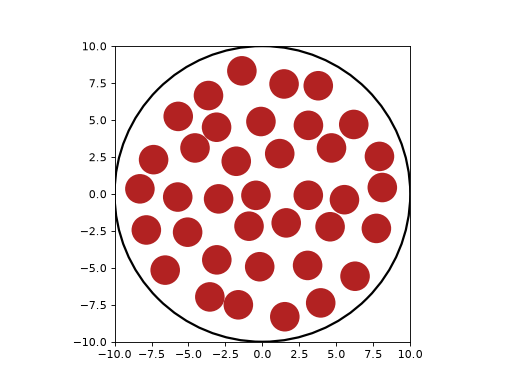
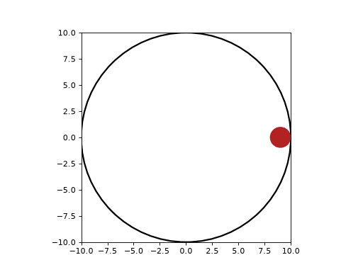
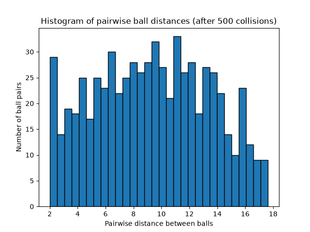
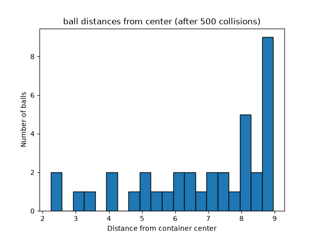
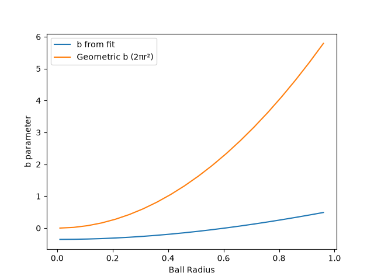
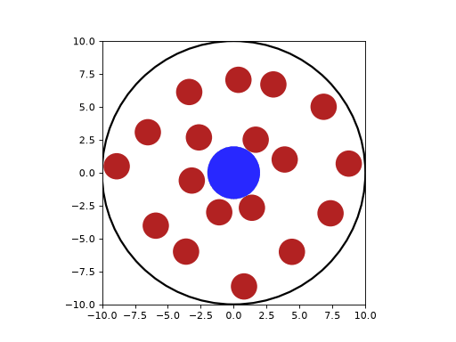

# ThermoSnooker

*[日本語版はこちら](#thermosnooker-日本語版)*

A 2D molecular dynamics simulation of a hard-sphere gas, extended to model Brownian motion and measure fluid viscosity. Built in Python using event-driven collision detection: instead of stepping time forward in fixed increments, the simulation solves for the exact time of the next collision and jumps straight to it.



The physics validated by this simulation includes conservation of energy and momentum, the ideal gas law and its breakdown, the Maxwell–Boltzmann speed distribution, Van der Waals corrections, and the Einstein–Stokes relation.

## Repository Structure

```
thermosnooker/
├── thermosnooker/          # Core simulation package
│   ├── __init__.py
│   ├── balls.py            # Ball and Container classes, collision logic
│   ├── physics.py          # Maxwell-Boltzmann distribution function
│   └── simulations.py      # Simulation classes (single, multi, Brownian)
├── analysis.py             # Runs demos and produces all figures
├── make_gifs.py            # Exports the animations as GIFs
├── Figures/                # Output figures and GIFs
├── thermosnooker_LR.pdf    # Full report
└── README.md
```

## How It Works

**Collision detection** (`balls.py`): For two balls with positions $\vec{r}_1, \vec{r}_2$ and velocities $\vec{v}_1, \vec{v}_2$, a collision occurs when the distance between their centres equals the sum of their radii:

$$
|\vec{r}_1 + \vec{v}_1 t - (\vec{r}_2 + \vec{v}_2 t)| = r_1 + r_2
$$

Expanding this gives a quadratic in $t$. The smallest positive root is the time of the next collision. `time_to_collision()` solves this for every pair; the simulation then advances all balls exactly to that moment and resolves the collision elastically along the line connecting the centres.

**Simulation classes** (`simulations.py`):
- `SingleBallSimulation` — one ball in a circular container, used to verify the collision logic
- `MultiBallSimulation` — a gas of many balls initialised in concentric rings with random velocity directions; tracks kinetic energy, momentum, pressure, and temperature
- `BrownianSimulation` — adds a heavier, larger tracer particle to the gas and records its trajectory over time

## Installation

```
git clone https://github.com/kaijamesrogers-dev/thermosnooker.git
cd thermosnooker
pip install numpy matplotlib scipy pillow
```

## Usage

Open `analysis.py` and set the `RUN` variable at the top of the file to choose a demo, then:

```
python analysis.py
```

To regenerate the GIFs, set `RUN` in `make_gifs.py` and run `python make_gifs.py`.

## Analysis Functions and Figures

### `single_ball_demo`

The simplest case: one ball bouncing inside the container. Used to verify that collision detection and elastic reflection work before scaling up to many balls.



### `multi_ball_animation`

A visual check that a full gas of balls neither sticks together nor escapes the container (animated at the top of this README).

### `plot_distance_histograms`

The quantitative version of the check above.



No ball pair is closer than the sum of their radii (2 units), confirming no overlaps.



No ball is further from the centre than the container radius minus the ball radius (9 units), confirming no escapes.

### `plot_conservation_checks`

Plots the ratio of kinetic energy and both momentum components at time $t$ to their initial values. All three ratios stay flat at 1, confirming the collision resolution conserves energy and momentum exactly. Also plots pressure against time, which takes a short while to settle to its equilibrium value.


### `plot_ideal_gas_comparisons`

Compares the simulated pressure against the ideal gas law prediction while varying temperature, container volume, and particle number in turn.


### `plot_temperature_ratio`

Quantifies where the ideal gas law breaks down. As ball radius increases, the balls take up a larger fraction of the container ("excluded volume") and the gas stops behaving ideally.


The ratio of the equipartition temperature to the ideal-gas temperature is close to 1 for small radii but drops systematically as the balls grow.

### `plot_speed_distributions`

Runs the gas at three initial speeds and histograms the equilibrium speeds against the theoretical Maxwell–Boltzmann distribution.


All balls start at the same speed, but collisions redistribute energy until the speeds follow the Maxwell–Boltzmann curve — the simulation reaches thermal equilibrium on its own.

### `plot_van_der_waals_fit`

Fits the temperature ratio to extract an effective Van der Waals $b$ parameter (the excluded-volume correction) and compares it with the simple geometric estimate $2\pi r^2$.



### `plot_brownian_trajectory`

The main result. A tracer particle (radius 2, mass 100) is placed in the gas of light particles and its position tracked over time.



The mean squared displacement (MSD) of a Brownian particle grows linearly with time:

$$
\langle r^2(t) \rangle = 4Dt
$$

The diffusion coefficient $D$ from the MSD–time fit, combined with the temperature from equipartition, gives the fluid viscosity via the Einstein–Stokes relation:

$$
\eta = \frac{RT}{6\pi D N_A r}
$$

The MSD is fit only after an initial burn-in period, since the system needs time to reach thermal equilibrium before the motion becomes cleanly diffusive.

## Report

Full method, results, and discussion: [thermosnooker_LR.pdf](thermosnooker_LR.pdf)

---

# ThermoSnooker (日本語版)

2次元剛体球気体の分子動力学シミュレーション。ブラウン運動のモデル化と流体粘度の測定まで拡張した。Pythonで実装し、イベント駆動型の衝突検出を採用している。時間を固定幅で進めるのではなく、次の衝突が起こる正確な時刻を解析的に求め、その瞬間まで直接進める方式である。


このシミュレーションで検証した物理: エネルギー・運動量保存、理想気体の状態方程式とその破綻、マクスウェル・ボルツマン速度分布、ファンデルワールス補正、アインシュタイン・ストークスの関係式。

## リポジトリ構成

```
thermosnooker/
├── thermosnooker/          # シミュレーション本体のパッケージ
│   ├── __init__.py
│   ├── balls.py            # Ball・Containerクラス、衝突判定ロジック
│   ├── physics.py          # マクスウェル・ボルツマン分布関数
│   └── simulations.py      # シミュレーションクラス（単一球・多球・ブラウン運動）
├── analysis.py             # デモの実行と全図の生成
├── make_gifs.py            # アニメーションのGIF出力
├── Figures/                # 出力図・GIF
├── thermosnooker_LR.pdf    # レポート全文
└── README.md
```

## 仕組み

**衝突判定** (`balls.py`): 位置 $\vec{r}_1, \vec{r}_2$、速度 $\vec{v}_1, \vec{v}_2$ を持つ2つの球は、中心間距離が半径の和に等しくなったとき衝突する:

$$
|\vec{r}_1 + \vec{v}_1 t - (\vec{r}_2 + \vec{v}_2 t)| = r_1 + r_2
$$

展開すると $t$ の2次方程式になる。最小の正の解が次の衝突時刻である。`time_to_collision()` が全ペアについてこれを解き、シミュレーションは全球をその時刻まで進めてから、中心を結ぶ直線に沿って弾性衝突を処理する。

**シミュレーションクラス** (`simulations.py`):
- `SingleBallSimulation` — 円形容器内の球1個。衝突ロジックの検証用
- `MultiBallSimulation` — 同心円状に配置し速度方向をランダム化した多数の球からなる気体。運動エネルギー・運動量・圧力・温度を追跡する
- `BrownianSimulation` — 気体中に大きく重いトレーサー粒子を追加し、その軌跡を記録する

## インストール

```
git clone https://github.com/kaijamesrogers-dev/thermosnooker.git
cd thermosnooker
pip install numpy matplotlib scipy pillow
```

## 使い方

`analysis.py` の冒頭にある `RUN` 変数でデモを選択し、以下を実行する:

```
python analysis.py
```

GIFを再生成するには、`make_gifs.py` の `RUN` を設定して `python make_gifs.py` を実行する。

## 解析関数と図

### `single_ball_demo`

最も単純な場合: 容器内で球1個が跳ね返る。多球へ拡張する前に、衝突判定と弾性反射が正しく動くことを検証する。


### `multi_ball_animation`

気体全体の球が、互いにくっついたり容器から飛び出したりしないことの目視確認（本README冒頭のアニメーション）。

### `plot_distance_histograms`

上記の確認を定量化したもの。


半径の和（2単位）より近い球のペアが存在しないことから、重なりがないことを確認できる。


容器半径から球半径を引いた値（9単位）より遠い球が存在しないことから、飛び出しがないことを確認できる。

### `plot_conservation_checks`

運動エネルギーと運動量両成分について、時刻 $t$ での値と初期値の比をプロットする。3つの比がすべて1で一定であることから、衝突処理がエネルギーと運動量を厳密に保存していることが分かる。圧力の時間変化もプロットしており、平衡値に落ち着くまで少し時間がかかる様子が見える。


### `plot_ideal_gas_comparisons`

温度・容器体積・粒子数をそれぞれ変化させ、シミュレーションの圧力を理想気体の予測と比較する。


### `plot_temperature_ratio`

理想気体の状態方程式が破綻する条件を定量化する。球の半径が大きくなると、球が容器に占める割合（排除体積）が増え、気体は理想的な振る舞いから外れていく。


エネルギー等分配則から求めた温度と理想気体から求めた温度の比は、小さい半径では1に近いが、半径が大きくなるにつれて系統的に低下する。

### `plot_speed_distributions`

3つの初期速度で気体を走らせ、平衡状態での速度ヒストグラムを理論的なマクスウェル・ボルツマン分布と比較する。


全球が同じ速さで始まるが、衝突によってエネルギーが再分配され、速度分布はマクスウェル・ボルツマン曲線に従うようになる。シミュレーションが自発的に熱平衡へ到達することを示している。

### `plot_van_der_waals_fit`

温度比のフィッティングから有効なファンデルワールス $b$ パラメータ（排除体積補正）を抽出し、幾何学的な推定値 $2\pi r^2$ と比較する。


### `plot_brownian_trajectory`

本プロジェクトの主要な結果。軽い粒子の気体中にトレーサー粒子（半径2、質量100）を置き、その位置を時間追跡する。


ブラウン運動する粒子の平均二乗変位（MSD）は時間に比例して増加する:

$$
\langle r^2(t) \rangle = 4Dt
$$

MSD-時間フィットから得た拡散係数 $D$ と、エネルギー等分配則から求めた温度を組み合わせ、アインシュタイン・ストークスの関係式から流体の粘度を算出する:

$$
\eta = \frac{RT}{6\pi D N_A r}
$$

MSDは初期のバーンイン期間の後にのみフィットする。系が熱平衡に達し、運動が明確に拡散的になるまで時間が必要なためである。

## レポート

手法・結果・考察の全文: [thermosnooker_LR.pdf](thermosnooker_LR.pdf)
